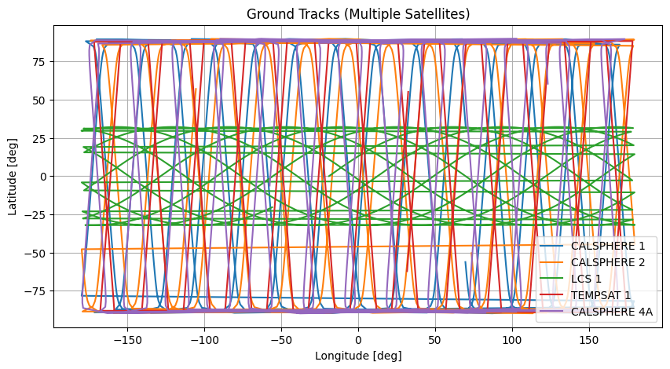
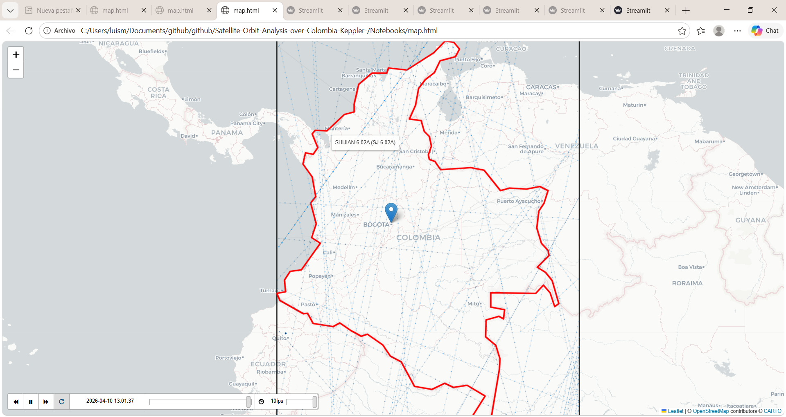
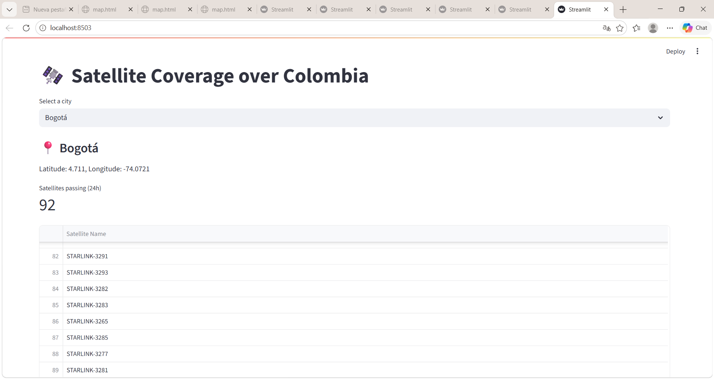

<p align="center">
  
</p>

<h1 align="center">🛰️ Satellite Orbit Analysis over Colombia</h1>

<p align="center">
<b>Flagship Project • GeoSpatial Intelligence Lab</b>
</p>

<p align="center">
Earth Observation • Orbital Mechanics • Scientific Computing • Geospatial Analytics
</p>

---

# Overview

**Satellite Orbit Analysis over Colombia** is an applied scientific project that combines orbital mechanics, satellite propagation, and geospatial analysis to study the trajectories and spatial coverage of Earth observation satellites over Colombian territory.

Using **Two-Line Element (TLE)** data and orbital propagation models, the project reconstructs satellite trajectories, visualizes ground tracks, and evaluates satellite visibility over the country's major cities through interactive geospatial tools.

---

# Objectives

- Retrieve and process real satellite **TLE** data.
- Propagate satellite orbits using orbital mechanics models.
- Visualize ground tracks and orbital trajectories.
- Analyze satellite coverage over Colombia.
- Develop an interactive dashboard for orbit exploration.

---

# Scientific Workflow

```text
Satellite TLE Data
        │
        ▼
Orbital Elements Extraction
        │
        ▼
Orbit Propagation
        │
        ▼
Ground Track Computation
        │
        ▼
Coverage Analysis
        │
        ▼
Interactive Visualization
```

---

# Repository Structure

```text
satellite-orbit-analysis/

├── app/
│   └── streamlit_app.py
│
├── assets/
│   ├── banners/
│   ├── figures/
│   └── diagrams/
│
├── data/
│
├── docs/
│
├── notebooks/
│   ├── 01_fetch_tle.ipynb
│   ├── 02_parse_tle.ipynb
│   ├── 03_propagation.ipynb
│   └── 04_satellite_coverage_by_city.ipynb
│
├── src/
│
├── README.md
├── LICENSE
├── CHANGELOG.md
├── CITATION.cff
└── requirements.txt
```

---

# Methodology

The project follows a reproducible scientific workflow:

1. Retrieval of current **Two-Line Element (TLE)** data.
2. Parsing and extraction of orbital parameters.
3. Orbit propagation using Keplerian and SGP4 models.
4. Ground-track generation.
5. Spatial analysis of satellite coverage over Colombia.
6. Interactive visualization through Streamlit.

---

# Technologies

## Programming

- Python

## Scientific Computing

- NumPy
- Pandas
- SciPy

## Orbital Mechanics

- SGP4
- TLE

## Geospatial Analysis

- Folium
- Matplotlib

## Interactive Applications

- Streamlit

---

# Results

## Ground Tracks



---

## Satellite Orbits over Colombia



---

## Coverage Analysis



---

# Interactive Dashboard

Run the application locally:

```bash
pip install -r requirements.txt

streamlit run app/streamlit_app.py
```

---

# Scientific Applications

This project can support research and applications in:

- Earth Observation
- Remote Sensing
- Orbital Mechanics
- Space Situational Awareness
- Geospatial Intelligence
- Satellite Mission Planning
- Environmental Monitoring

---

# Citation

If you use this project in academic or technical work, please cite it using the metadata provided in **CITATION.cff**.

---

# License

This project is distributed under the **MIT License**.

---

# GeoSpatial Intelligence Lab

**Transforming Geospatial Data into Scientific Intelligence**

This repository is part of the research portfolio of **GeoSpatial Intelligence Lab**, an independent applied research laboratory dedicated to Earth Observation, GeoAI, Scientific Computing, and Decision Intelligence.
